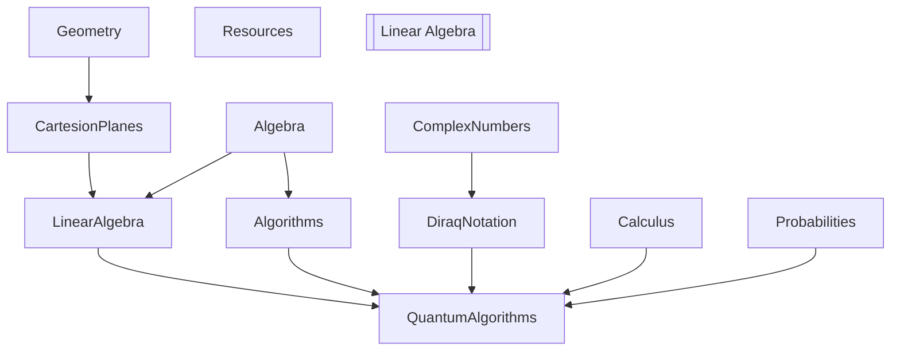

# Learning Topics


## Atomic Study Ninja
*Install Dependencies**
```
poetry install
```

*Run it*
```
poetry run atomic_study_ninja
```


## Appendix - Study Topics

- Linear Algebra
- Complex Numbers
- Calculus
  - Differenttial
  - Integral Calculus
- Probabilities
- Diraq Notation


## Linear Algebra
* MIT - Gilbert Strang - https://math.mit.edu/~gs/linearalgebra/ila6/indexila6.html
* 3Blue1Brown - YouTube Lessons - https://www.3blue1brown.com/topics/linear-algebra
What is the undelying cause of the speed improvement ?
This is a great point - we should hilight it
