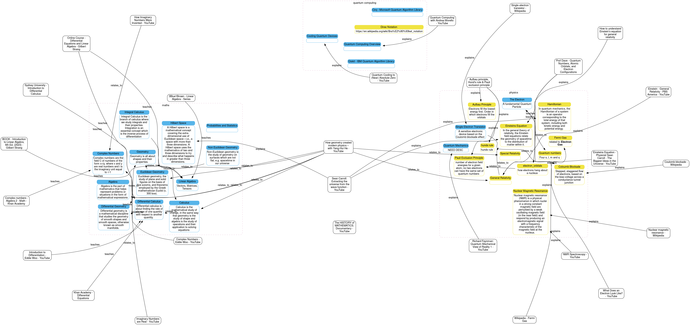

# Atomic Study Ninja

This repo is two things

- an infographic / mind map manager
- all topics related to physics, maths, electronics, and quantum computing

## TL;DR

```
❯ python src/atomic_study_ninja/main.py  study_fields.yaml --output_type dot --output_file sample.dot | dot -Tsvg > study_fields.svg
```

```
❯ python src/atomic_study_ninja/main.py study_fields.yaml reference add https://en.wikipedia.org/wiki/Coulomb_blockade
```

```
❯ python src/atomic_study_ninja/main.py study_fields.yaml link relates_to howgeometrycreatedmodernphysicswithyanghuiheyoutube general_relativity
```


## Development
*Install Dependencies**
```
poetry lock # adding a new dep
poetry install
```

*Run it*
```
poetry run atomic_study_ninja <args>
python src/atomic_study_ninja/main.py <args>
```


## Learning Math, Physics and Quantum Computing


