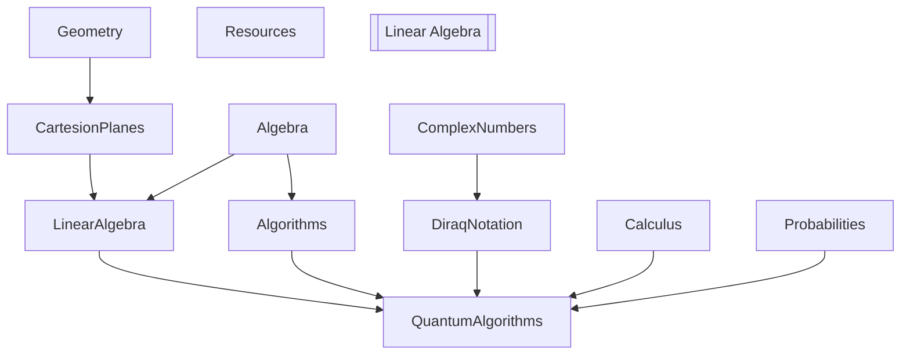

# Learning Topics

This repo is two things

- an infographic / mind map manager
- all topics related to physics, maths, electronics, and quantum computing

## TL;DR

```
❯ python src/atomic_study_ninja/main.py  study_fields.yaml --output_type dot --output_file sample.dot | dot -Tsvg > study_fields.svg
```

```
❯ python src/atomic_study_ninja/main.py reference add study_fields.yaml https://en.wikipedia.org/wiki/Coulomb_blockade
```


## Atomic Study Ninja
*Install Dependencies**
```
poetry lock # adding a new dep
poetry install
```

*Run it*
```
poetry run atomic_study_ninja <args>
python src/atomic_study_ninja/main.py <args>
```


## Appendix - Study Topics

- Linear Algebra
- Complex Numbers
- Calculus
  - Differenttial
  - Integral Calculus
- Probabilities
- Diraq Notation


## Linear Algebra
* MIT - Gilbert Strang - https://math.mit.edu/~gs/linearalgebra/ila6/indexila6.html
* 3Blue1Brown - YouTube Lessons - https://www.3blue1brown.com/topics/linear-algebra
What is the undelying cause of the speed improvement ?
This is a great point - we should hilight it
