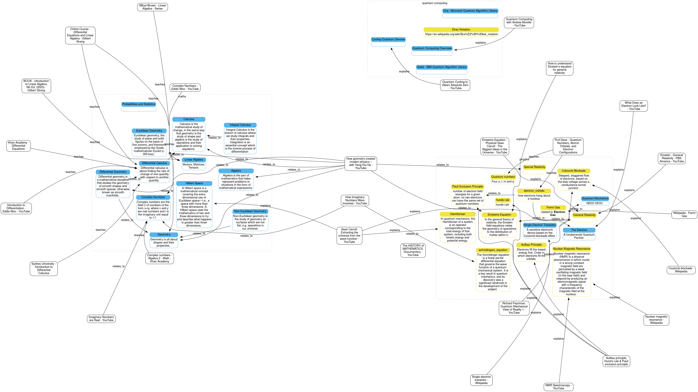

# Atomic Study Ninja

This repo is two things

- an infographic / mind map manager
- all topics related to physics, maths, electronics, and quantum computing

## TL;DR


**as a PDF**
```
python src/atomic_study_ninja/main.py  study_fields.yaml --output_type dot --output_file sample.dot | dot -Tpdf > study_fields.pdf
```

**as an SVG file**
```
❯ python src/atomic_study_ninja/main.py  study_fields.yaml --output_type dot --output_file sample.dot | dot -Tsvg > study_fields.svg
```

**Add a URL**
```
❯ python src/atomic_study_ninja/main.py study_fields.yaml reference add https://en.wikipedia.org/wiki/Coulomb_blockade
```

**Link the URL to something**
```
❯ python src/atomic_study_ninja/main.py study_fields.yaml link relates_to howgeometrycreatedmodernphysicswithyanghuiheyoutube general_relativity
```

**Link two things**
```
❯ python src/atomic_study_ninja/main.py study_fields.yaml link relates_to howgeometrycreatedmodernphysicswithyanghuiheyoutube general_relativity
```

**List all the IDs of the things**
```
❯ python src/atomic_study_ninja/main.py study_fields.yaml list
```
**CLI Help**
```
❯ python src/atomic_study_ninja/main.py
Usage:
    atomic_study_ninja <study_file> --output_type dot --output_file <file>
    atomic_study_ninja <study_file> reference add <url>
    atomic_study_ninja <study_file> link teaches <topic1> <topic2>
    atomic_study_ninja <study_file> link relates_to <topic1> <topic2>
    atomic_study_ninja <study_file> link explains <topic1> <topic2>
    atomic_study_ninja <study_file> list
    atomic_study_ninja --help
    atomic_study_ninja --schema

❯ python src/atomic_study_ninja/main.py  --help
Atomic Study Ninja

Usage:
    atomic_study_ninja <study_file> --output_type dot --output_file <file>
    atomic_study_ninja <study_file> reference add <url>
    atomic_study_ninja <study_file> link teaches <topic1> <topic2>
    atomic_study_ninja <study_file> link relates_to <topic1> <topic2>
    atomic_study_ninja <study_file> link explains <topic1> <topic2>
    atomic_study_ninja <study_file> list
    atomic_study_ninja --help
    atomic_study_ninja --schema

Options:
  --help
  <study_file>            the YAML file
  --output_type           dot   output to Graphviz DOT format [default: dot]
  --output_file <file>    The file to save to
  --schema                Output the JSON Schema file (as YAML)

```


## Development
*Install Dependencies**
```
poetry lock # adding a new dep
poetry install
```

*Run it*
```
poetry run atomic_study_ninja <args>
python src/atomic_study_ninja/main.py <args>
```


## Learning Math, Physics and Quantum Computing

**As a PDF** (it has URLS)
[study_fields.pdf](study_fields.pdf)


