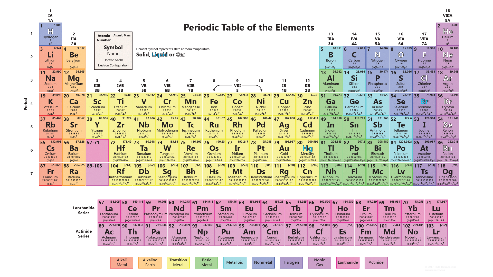
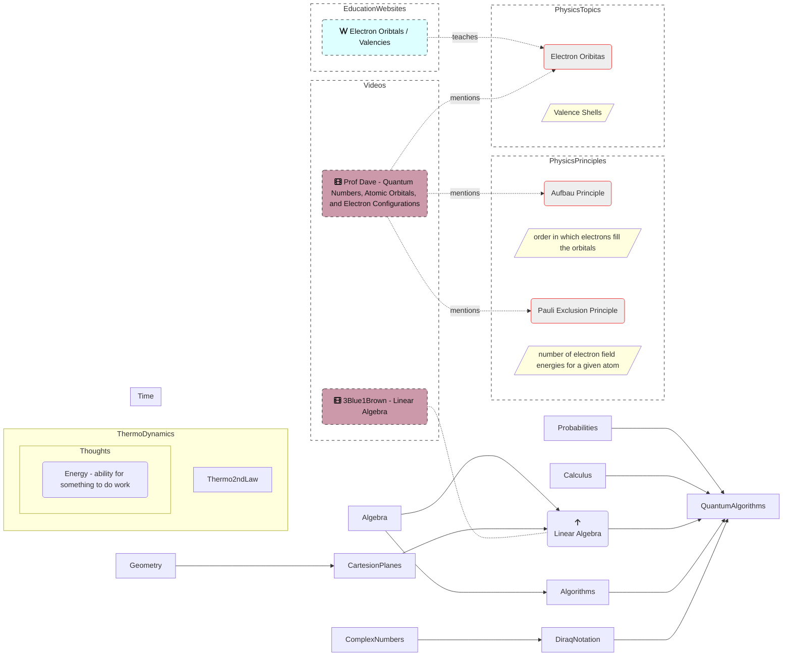

### Topics Mind Map

```mermaid

%%{init: { 'logLevel': 'debug', 'theme': 'forest' } ,  htmlLabels: true, flowchart: {htmlLabels: true}, securityLevel: 'loose'}%%

flowchart LR
    classDef videoLessons fill:#c9a,stroke:#222,stroke-width:1px,color:#111,stroke-dasharray:6
    classDef websiteLessons fill:#dff,stroke:#222,stroke-width:1px,color:#111,stroke-dasharray:6


    classDef nofillDashed stroke:#222,stroke-width:1px,fill:#fff,stroke-dasharray:6
    classDef clear fill:#fff,color:#fff,stroke-width:0px

    classDef principle stroke:#e22,stroke-width:1px,fill:#eee
    classDef note fill:#FFFFE0

    %%------------------------
    LinearAlgebra(fa:fa-arrow-up<br/>Linear Algebra )

    subgraph Videos
         video_linalg_3b1b
         video_atomic_orbitals
    end
    Videos:::nofillDashed

    subgraph EducationWebsites
         website_electron_orbitals
    end
    EducationWebsites:::nofillDashed

   subgraph PhysicsPrinciples

         subgraph _PauliExclusionPrinciple
            direction LR
            PauliExclusionPrinciple(Pauli Exclusion Principle):::principle
            PauliExclusionPrinciple_note[/number of electron field energies for a given atom/]
            PauliExclusionPrinciple_note:::note
         end
         _PauliExclusionPrinciple:::clear


         subgraph _Aufbau
            direction LR
            AufbauPrinciple(Aufbau Principle):::principle
            Aufbau_note[/order in which electrons fill the orbitals/]
            Aufbau_note:::note
         end
         _Aufbau:::clear
    end
    PhysicsPrinciples:::nofillDashed

   subgraph PhysicsTopics

         subgraph _ElectronOrbitals
            direction LR
            ElectronOrbitals(Electron Oribitas):::principle
            ElectronOrbitals_note[/Valence Shells/]
            ElectronOrbitals_note:::note
         end
         _ElectronOrbitals:::clear

    end
    PhysicsTopics:::nofillDashed


    website_electron_orbitals(fa:fa-w Electron Oribtals / Valencies)
    website_electron_orbitals:::websiteLessons
    click website_electron_orbitals "https://www.fluxsci.com/flux/valence1" "Website" _parent

    video_linalg_3b1b(fa:fa-film 3Blue1Brown - Linear Algebra)
    video_linalg_3b1b:::videoLessons
    click video_linalg_3b1b "https://www.youtube.com/watch?v=fNk_zzaMoSs&list=PLZHQObOWTQDPD3MizzM2xVFitgF8hE_ab" "3Blue1Brown - Youtube Lessons" _parent

    video_atomic_orbitals(fa:fa-film Prof Dave - Quantum Numbers, Atomic Orbitals, and Electron Configurations)
    video_atomic_orbitals:::videoLessons
    click video_atomic_orbitals "https://www.youtube.com/watch?v=Aoi4j8es4gQ" "Prof Dave - Quantum Numbers, Atomic Orbitals, and Electron Configurations" _parent


    video_linalg_3b1b -.- LinearAlgebra
    video_atomic_orbitals -.mentions.-> PauliExclusionPrinciple
    video_atomic_orbitals -.mentions.-> AufbauPrinciple
    video_atomic_orbitals -.mentions.-> ElectronOrbitals
    website_electron_orbitals -.teaches.-> ElectronOrbitals

   Geometry --> CartesionPlanes --> LinearAlgebra
   Algebra --> LinearAlgebra
   DiraqNotation --> QuantumAlgorithms
   Algorithms --> QuantumAlgorithms
   Algebra --> Algorithms
   LinearAlgebra --> QuantumAlgorithms
   Calculus --> QuantumAlgorithms
   ComplexNumbers --> DiraqNotation
   Probabilities --> QuantumAlgorithms
   subgraph ThermoDynamics

        Thermo2ndLaw
        subgraph Thoughts
             Energy(Energy - ability for something to do work)
        end
   end


   subgraph Time

        Thermo2ndLaw
   end

```
